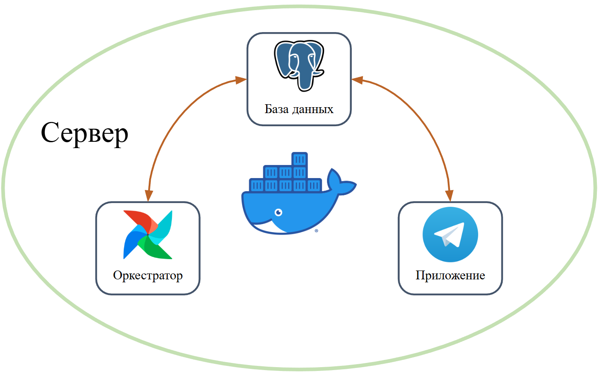

<div align="center">

# :zap: Telegram-bot с прогнозом погоды :zap:

</div>

---

## :fire: В данном репозитории реализован проект :page_facing_up:, который включает в себя: 

- :robot: **[Telegram-bot](https://github.com/badubidabambirimbum/weather-forecast-bot/tree/main/app/src/telegram_bot):** для предосталвения прогноза погоды и температуры воздуха.
- :thermometer: **[Модель нейронной сети](https://github.com/badubidabambirimbum/weather-forecast-bot/tree/main/app/src/machine_learning):** для предсказания температуры воздуха.
- :globe_with_meridians: **[Парсинг web-сайтов](https://github.com/badubidabambirimbum/weather-forecast-bot/tree/main/app/src/weather_scrapers):** для получения данных о прогнозе погоды.
- :alarm_clock: **[Airflow](https://github.com/badubidabambirimbum/weather-forecast-bot/tree/main/app/AirFlow):** для автоматизации работы с данными.
- :floppy_disk: **[PostgreSQL](https://github.com/badubidabambirimbum/weather-forecast-bot/tree/main/DockerBuild/PostgreSQL/init_sql_scripts):** для хранения данных Telegram-bot-а и AirFlow.
- :package: **[Docker](https://github.com/badubidabambirimbum/weather-forecast-bot/blob/main/docker-compose.yaml):** для удобства работы с проектом.

<p align="center">
  
</p>

---

## Быстрый старт :turtle:

- Все команды выполняются из корневой директории проекта - weather-forecast-bot
- требуется переименовать папку secret_example из app в secret: `secret_example -> secret`
  - Это можно сделать командой:
```bash
mv ./app/secret_example ./app/secret
```
- Далее, в папке secret требуется вставить свои данные (config.env, variables.json):
  - Токен Телеграм-Бота
  - ID администратора
  - ID телеграм-канала, куда будут отправляться логи
- Запустить проект в первый раз:
> `./run.sh 0 0 1 1 1`

---

### Параметры run.sh:
> 1. удаление всех контейнеров из docker-compose.yml
> 2. удаление всех образов, которые созданы из docker-compose.yml
> 3. Build images
> 4. Инициализация Airflow
> 5. Запуск Проекта (Airflow + PostgreSQL + TelegramBot)

---

### Структура проекта

```
weather-forecast-bot/
├── app/
│   ├── AirFlow/ # Все с airflow
│   │   ├── dags/   # DAG-и
│   │   │   ├── GisMeteo/  # DAG-и для сбора данных с сайта GisMeteo (запуск каждый день)
│   │   │   ├── Yandex/    # DAG-и для сбора данных с сайта Yandex (запуск каждый день)
│   │   │   ├── Fit/       # DAG-и для обучения модели (запуск раз в месяц)
│   │   │   └── Predict/   # DAG-и для получения прогноза по температуре воздуха на 10 дней (запуск каждый день)
│   │   └── utils/  # Доп функции для DAG-ов (в данном случае храним функция отправки в тг сообщения о падении DAG-а)
│   ├── secret/  # Здесь лежат файлы с переменными. (логины, пароли и тд)
│   └── src/     # Код проекта
│       ├── core/   # Хранится класс для взаимодейсвтия с БД и функции для логирования
│       ├── machine_learning/ # Все для ML-модели: сбор данных, предобработка, обучение, предикт, сохранение всего в БД
│       ├── telegram_bot/     # Функции телеграм-бота
│       └── weather_scrapers/ # Функции для парсинга сайтов по прогнозу погоды
├── DockerBuild/ # Все для сборки контейнеров и корректной работы проекта
│   ├── AirFlow/            # Dockerfile
│   ├── MachineLearning/    # Dockerfile + requirements.txt
│   ├── PostgreSQL/         # Список команд для инициализации БД: создаем пользователей, схемы и таблицы
│   └── TelegramBot/        # Dockerfile + requirements.txt
├── docker-compose.yaml  # запускает все сервисы
├── photo/ # photo для README.md
└── README.md
```